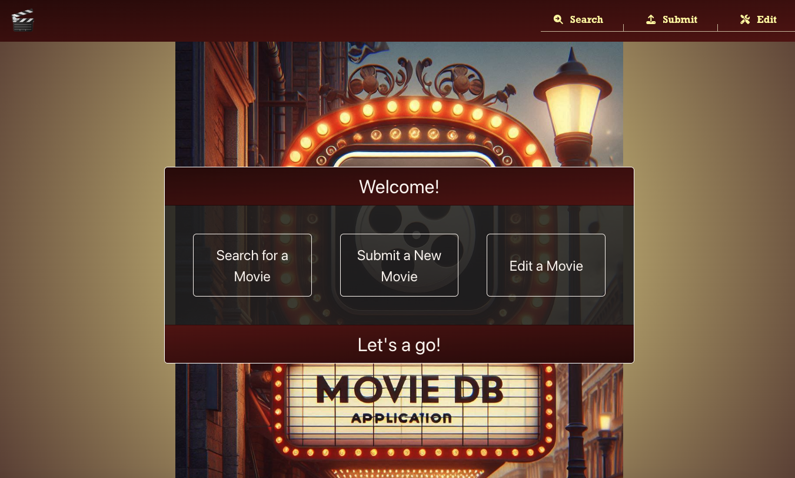
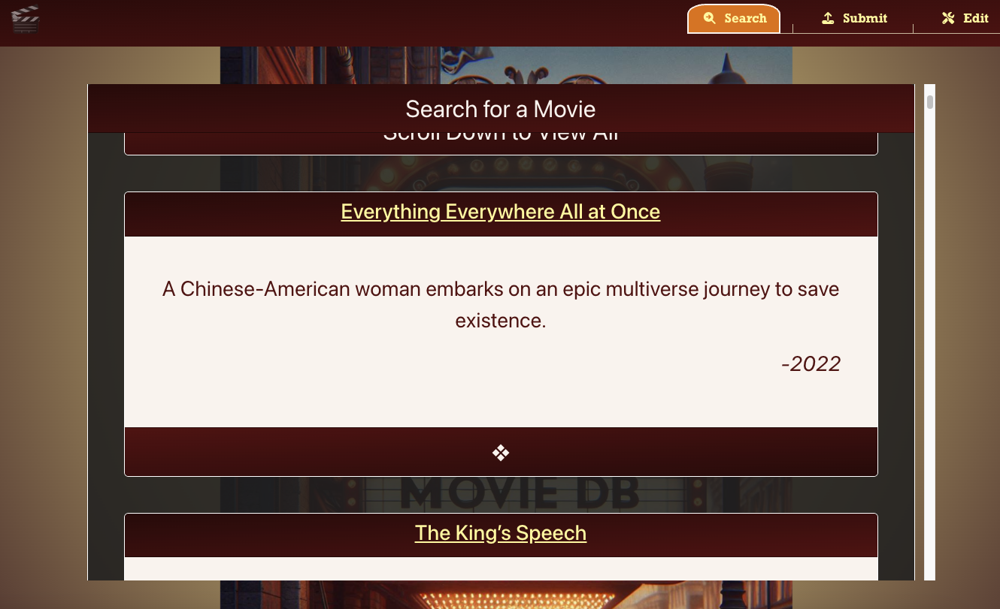

# RI Presentation Interview for Patrick Mikes, 9/12

- ### To view rendered markdown in VSC, press shift cmd v 

## ❖ Initial Set Up Instructions
- ### To start the mongod server, in separate terminal window (a window that you can leave open for the duration during which you want the database to be accessible), enter the command

        $ mongod --dbpath /usr/local/var/mongodb

    Alternatively, you can also just run the built in npm script, but all it does is the same as above

        $ npm run launchMongo

- ### Split Terminal windows in VSC
    - We want two terminals open simultaneously, one representing our front end dev server (create react app), the other our backend API server with express
    - To open the integrated terminal with VSC, you can press the key combination ctrl and \` (the \ is an escape character for the markdown format, it's not one you press. If you're seeing that, you should hit shift cmd v to see the rendered version of this markdown file) 
    - Once you have a single terminal open, to open a split second terminal, you can press the keys cmd \\. Alternatively in the terminal toolbar right above the terminal window in vsc, you can click the split pane icon.
    
- ### Server set up
    - From the root project directory, enter the server/ directory with the command

            $ cd server/
    
    - Install the node modules
    
            $ npm install
    
    - To seed the DB with the initial Data, run the following command
    
            $ npm run seed
    
    - As an alternative, to seeding from the BSON file, you can seed directly from a json file with
    
            $ npm run importDBfromJSON
    
    - At this point, you should be ready to launch the backend server, just run the command
    
            $ npm start
    

- ### Front End Dev Server set up
    - From the root project directory, enter the client/ directory with the command
    
            $ cd client/
    
    - Install the node modules

            $ npm install

    - All you should need to do now to launch the dev server from create-react-app is run the command
    
            $ npm start

  - This last command should have automatically opened your browser and pointed it the address for the development server. The app should look like this: 

  

----

# 1: - Routing with React Router
### (A): <u>Pull up the file for App.js, which can be found at</u>
[Click here to pull up App Component](./client/src/base/App.js)
```
./client/src/base/App.js
```
```js
export default function App() {
  return (
    <div className="App">
      <BrowserRouter>
        <Routes>
          <Route element={<Layout />}> 
            <Route path="/" element={<Landing />}></Route>
            <Route path="/search" element={<Search />}></Route>
            <Route path="/submit" element={<Submit />}></Route>
            <Route path="/edit/:id" element={<Edit />}></Route>
          </Route>
        </Routes>
      </BrowserRouter>
    </div>
  );
}
```
- Here you can see the Route tree for the entire application. Another way to think of this is like a site-map - it specifies all the different pages that are reachable through the app. 
- One of these routes in particular is different from the others though.
  - Which one is it?
  - What makes it different?
  - What does the different mean? 

- If you said the `<Layout>` route, congratulations! It's different because <u>*it doesn't have any path attribute*</u>. This makes it what is creatively named as a <u>layout route</u> in React Router (not to be confused with the Layout component which the route renders)
- In React Router, layout routes are used when you have some JSX that you'd like to be a parent to an entire set of routes. It saves you from having to repeat the same code for each individual page. It's named this because most commonly, the sort of thing it's used for is when you have a set of pages that you want to display nested within common HTML, and perhaps apply common styles and functionality. The layout route simply wraps all the nested routes in its element. 
- Let's head over the this Layout component and check it out. 

### (B): <u>Pull up the file for the Layout component, which can be found at </u>
[Click here to pull up Layout Component](./client/src/components/Layout/index.js)
```
./client/src/components/Layout/index.js
```
```js
import { Outlet } from "react-router"
import Navbar from "../Navbar/"
import "./layout.css"

export default function Layout() {
    return (
        <div className="Layout">
            <Navbar></Navbar>
            <main>
                <Outlet></Outlet>
            </main>
        </div>
    )
}
```
- Does anyone see a component that might be important for making this a true layout route?

- The `<Outlet></Outlet>` component!! 
- What this Outlet component does is tell React Router to render, at this location in the entire DOM, whichever one of the `<Route>`s nested inside the layout `<Route>` (see above, `App.js`) correctly matched the url the visitor has navigated to. 
- So for instance, if we visited `/search`, what the router renders would look like this
```html
<Lavout>
   <Search></Search>
</Layout>
```
- What would be the biggest benefit for structuring your code this way?


- <u>*REUSABILITY*</u>. You can see in this example here, using the layout route allows me to apply both the common html elements I want present on every page (`<Navbar>` and `<main>`), and also to apply a set of common styles (`import './layout.css'`). I only need to do this once!

#### <u>Bonus Exercise</u>
  - What happens though in our application if somebody tries to visit a URL for which there is no match? We need to implement a generic, catch-all route that will display a nice message gently telling our user they're lost, and helping them back to the home page. 
    - (Hint) what symbol is often used, for instance in RegExps or glob patterns, when we want to specify a character/characters that matches anything? You may have also heard it called a wildcard symbol. Where would you use this in a `<Route>` component? 
  - Once you're done, test it out in the app by trying to navigate to some random, misnamed page, see if your new component renders correctly


# 2: - Reusability

 - I've said it before, and I'll say it again; making reusable components is the name of the game in react. It's ability to streamline the development process can be a game changer, particularly when you have a tight deadline you need to meet (which will basically be alwuays in the professional world.)
 - One of the most common elements that can really benefit from reusability are Cards. I've ended up using them all over most of my applications, and you can see them used over and over in this application. 
 - Reusability can be a double-edged sword however.
   - You want to make your reusable components able to customized, to take in specific content for instance. 
   - However, it can be easy to fall into the trap of making a single component overly complex in order to accomodate many different use cases, when you might actually be better served simply making a separate component. 
 - It's a balancing act, but here are some tips on some simple ways to make your components BOTH <u>*reusable*</u> and <u>*customizable*</u>
 
  ### (A): <u>Pull up the file for the Card component</u>
[Click here to pull up Card Component](./client/src/components/Card/index.js)
```
./client/src/components/Card/index.js
```
```js
import { Card } from "react-bootstrap"
import "./cardStyle.css"

const { Header, Body, Footer } = Card 

export default function CustomCard({header="header", footer="footer", style=null, classes='', children=null}) {
    return (
            <Card style={{...style}} className={`default-card-class ${classes}`}>
                <Header className="fs-2" style={{position: 'sticky', top: 0, zIndex:5}}>{header}</Header>
                <Body className="d-flex p-5" style={{zIndex: 0}}>{children}</Body>
                <Footer className="fs-2" style={{zIndex: 0}}>{footer}</Footer>
            </Card>
    )
}
```
 - First, look at the very top import. We're using a Card component from react-bootstrap, so it already has a lot of helpful pre-defined styles for us to use as a base. 
 - Can anyone describe to me what this line here is doing? What is it called, and why is it here?  
 ```js 
 const { Header, Body, Footer } = Card 
 ```
 - Look at the function signature. What is the set of {} braces doing inside there? `function CustomCard({ --- })`
  - Answer: All react function components really only receive a single argument, most often called <u>*props*</u>. However, we almost always need more than one value to create our component. So props is an object, and its property names are the attribute names that were passed via the JSX used to render the component. 
  - For instance, 
  ```jsx
  <MyComponent p1={'someString'} p2={42}></MyComponent>
  ```  
   - if MyComponent has a signature that looks like this
  ```js
  export default function MyComponent(props){
        // in here, props is an object that for this rendering, was passed these two properties
        // {
        //   p1: 'someString',
        //   p2: 42
        // }
  }
  ```
   - However, especially in components where there are a many prop values, it can become tedious to have to preface every reference to one of them by saying props.p1, or props.whatever. 
   - That's why we can destructure the individual properties directly in the function signature itself, like so
```js
  export default function MyComponent({p1, p2}){
        // Now in here, we can simply refer directly to the 'parameters' p1 and p2, without having to access them through the props parameter first
  }
  ```
  - Back to the Card Example, We've destructured 5 parameters out the single props object
   1. header
   2. footer
   3. style
   4. classes
   5. children (special property, will talk about below)
  - header and footer are simply whatever we want to render inside the Card `<Header>` and `<Footer>` tags. Often times these will just be strings, but they could also be JSX elements themselves, such as `<Button>`s, `<div>`s, etc. 
  - Passing a <u>style</u> object is another really easy way to make a reusable element customizable. We can have whatever general default styles we want every card to have defined in a separate css file (such as `./cardStyle.css`). But passing a style object and spreading it as the value to the Underlying elements style attribute like this is a really easy way to allow yourself to specify additional styles or even override the default styles on demand
  ```js
  <Card style={...style}>
  ```
  - Passing <u>classes</u> as a prop value is also another easy way to add a layer of customization. Here is a method that allows you both to specify some default classes, like `default-card-class` but also add your own, using string literal interpolation. One important caveat to note with this approach is that it's important to give classes a default argument value, typically of an empty string. Otherwise, if it's undefined, 'undefined' is going to show up as an unintended class added to the Card. 
  ```js
  <Card className={`default-card-class ${classes}`}>
  ```
  - Last but not least, the <u>children</u> prop. Unlike the other prop values, this one is <u>*NOT*</u> passed like an attribute in between the `<>` tags. Rather, any JSX elements that are passed as descendants in between the opening and closing component tags get gathered up and passed as a single value `children`. Note, this is also why you can't specify multiple siblings as direct descendants to a component, but need to wrap them inside of a `<></>` fragment tag.
  - This is the easiest way to customize, typically the main content of your component. However, it can only be used once in the component, so here I've used it to display whatever body element I want. 

### (B): <u>Pull up the file for the Landing Page component</u>
[Click here to pull up Landing Page Component](./client/src/pages/landing/index.js)
```
./client/src/pages/landing/index.js
```
```js
export default function Landing() {
    const navigate = useNavigate();

    const memoized_props = useMemo(() => {
        return {
            header: "Welcome!",
            footer: "Let's a go!",
            classes: "landing-card"
        }
    }, [])

    return (
        <Card {...memoized_props} >
            <div className="d-flex justify-content-around landing-body">
                <Button className="fs-4" variant="outline-primary" onClick={() => navigate('/search')}>Search for a Movie</Button>
                <Button className="fs-4 mx-5" variant="outline-primary" onClick={() => navigate('/submit')}>Submit a New Movie</Button>
                <Button className="fs-4" variant="outline-primary" onClick={() => navigate('/edit')}>Edit a Movie</Button>
            </div>
        </Card>
    )
}
```
- In this code, here I've specified the props header, footer, and classes. 
  - Bonus: Why would I use a useMemo hook for this?
- I've also passed a `<div>` for the children prop (the one with the className `landing-body`) 
- There's also an example of using another of the hooks featured in react-router, <u>*useNavigate()*</u>
  - This hook returns a function that you can invoke (such as on the click of a button, as I did here) to trigger a navigation similar to clicking on a link. 
  - What is an alternative component from react-router I could use to achieve this same effect? 

# 3: - Working with data in React
### (A): <u>Take a look at our example dataset</u>
[Click here to pull up our data in JSON format](./server/database/seed/backups/movieData.json)
```
./server/database/seed/backups/movieData.json
```
  - Here you can see what our dataset looks like,
```js
  {
    "title": "Everything Everywhere All at Once",
    "description": "A Chinese-American woman embarks on an epic multiverse journey to save existence.",
    "year": 2022,
    "id": "Everything%20Everywhere%20All%20at%20Once"
  }
```
  - and how these objects map to our mongoose model
```js
  const schema = new mongoose.Schema({
    title: {type: String, required: true}, 
    description: {type: String, required: true}, 
    year:  {type: Number, required: true},
    id: {type: String, required: true}
  })
```

  ### (B): <u>Pull up the file for the Search Page component, which can be found at</u>
[Click here to pull up Search Page Component](./client/src/pages/search/index.js)
```
./client/src/pages/search/index.js
```
  - First, lets see how we're fetching the data from our server to populate this page with all the entries. 
  ```js
      const [movies, setMovies] = useState(null)
      //...
      //...
      useEffect(() => {
        fetch('/api/search')
            .then(r => r.json())
            .then(r => setMovies(r.data))
    }, [])
  ```
    - ? Who can tell me what the useEffect hook here is doing? When does it do it? What does the empty array have to do with anything?
  - Next, assuming we've succesfully fetched all the movie documents from our DB, how are we going to display them? Since there's many of them, this sounds like a great use case for another reusable component. Let's call it `MovieBlock`
  
[Click here to pull up MovieBlock Component](./client/src/components/MovieBlock/index.js)
```
./client/src/components/MovieBlock/index.js
```
  - So we want to take our array of movie documents, and use them to render a bunch of these `<MovieBlock>` components. 
  - ? 
    - What technique should we use to do this directly in the JSX? 
    - Are there any common gotchas we need to watch out for when using this technique?
    - What should we do about the fact that our dataset might not be available right when the page first loads? 

  - How about we do something like the following block of code
  ```js
        {
          movies && Array.isArray(movies)
            ? movies.map((el, i) => <MovieBlock key={i} {...el}></MovieBlock>)
            : null
        }
  ```
  - Use the Array.map method to iterate over an array, and use each array element to render a JSX element
  - When mapping in JSX, <u>*be sure not to forget that each JSX element needs a unique key value!*</u>
  - We can use a ternary expression (`boolean ? (val if true) : (val if false)`) to only perform the mapping once our movies state has been defined, and movies is in fact an Array. Otherwise, the whole expression evalutes to null, which doesn't render anything in JSX. 
  - If everything goes right, we should end up with this



[Click here to visit the search page in the browser](http://localhost:3000/search)

---
# 🛠️ Exercise
- If you scroll down a bit on the search page and try clicking on any of the links in the headers, you'll notice all any of them do is take us back to the home page. 
- Instead, lets make it to where clicking that link in each MovieBlock takes us to a page dedicated to editing that movie. 
- Let's do it using a `route parameter` that relies on the `_id` of each movie. (Note, each movie also has an `id` field, but this is different. We're going to use `_id` because it allows mongoDB to quickly find an individual movie for us, using the automatic DB index on that field. )

1. First, let's make sure our back end is set up correctly to handle requests to go to a particular edit page. 
 - We have our api routing modularized from the main server.js file with this line of code. <u>*Note*</u> all api requests a prefixed with `/api`
 ```js
 app.use('/api', MovieRouter) 
 ```
 - In the [Movie Router File](./server/routing/MovieRouter.js), `./server/routing/MovieRouter.js`, where is the routing for the edit page? 


1. Go back to the `<MovieBlock>` Component [Here](./client/src/components/MovieBlock/index.js)
  - Where is the link functionality implemented, and how can we fix it using the parameters provided?


